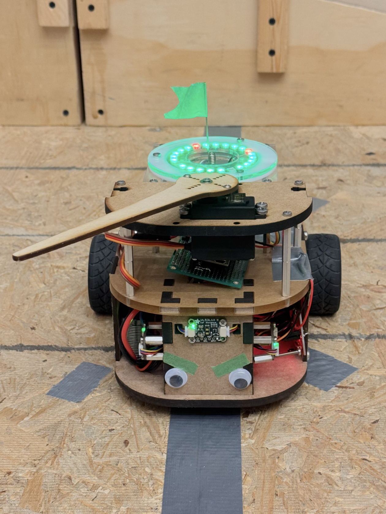
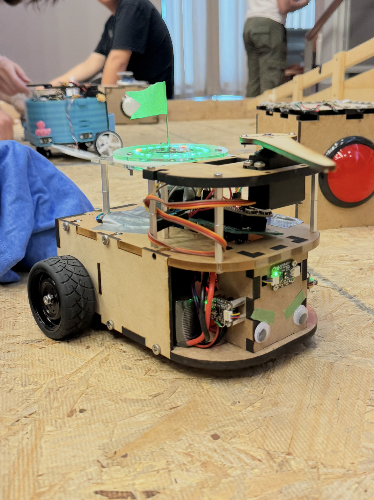
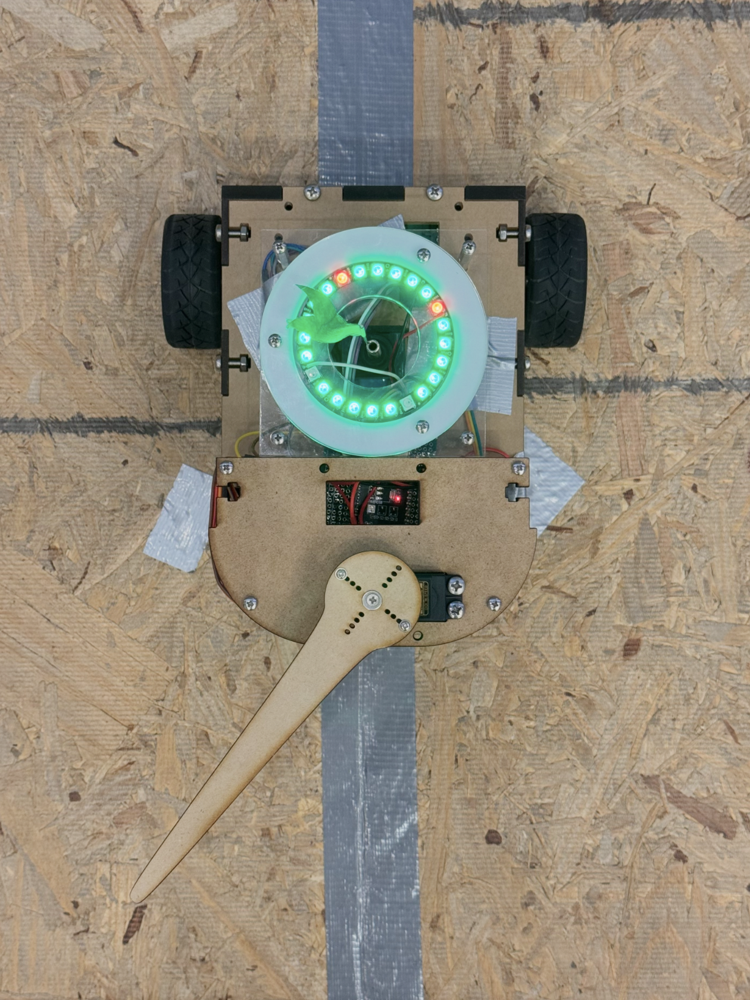
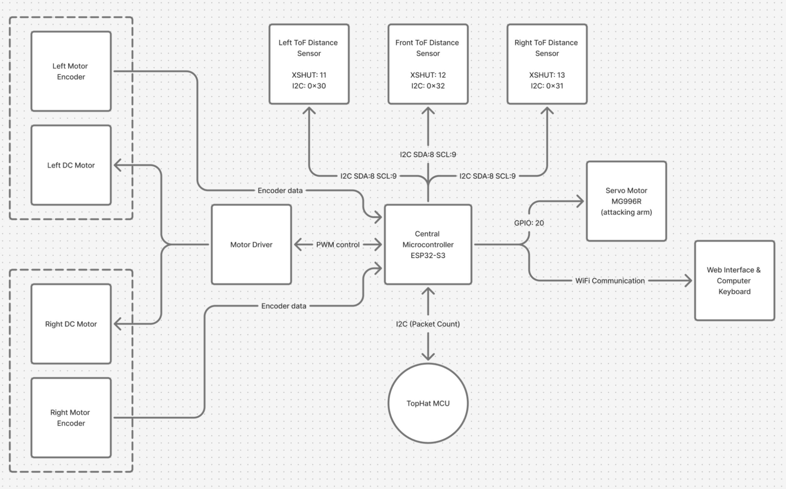
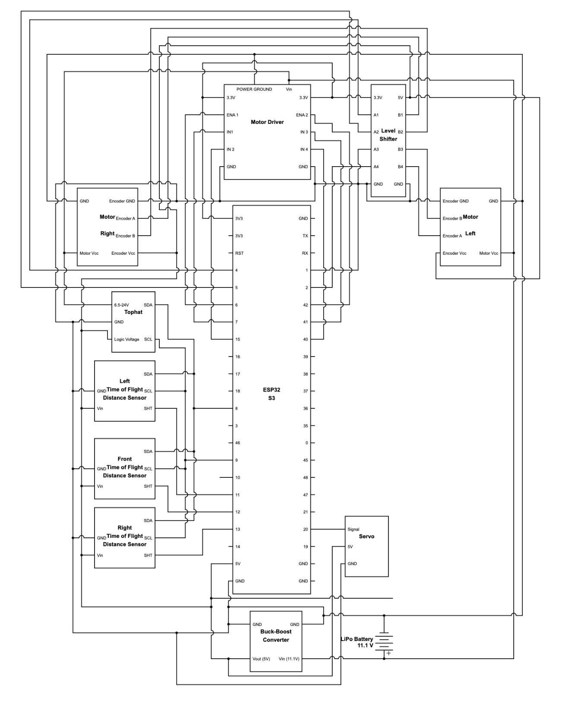
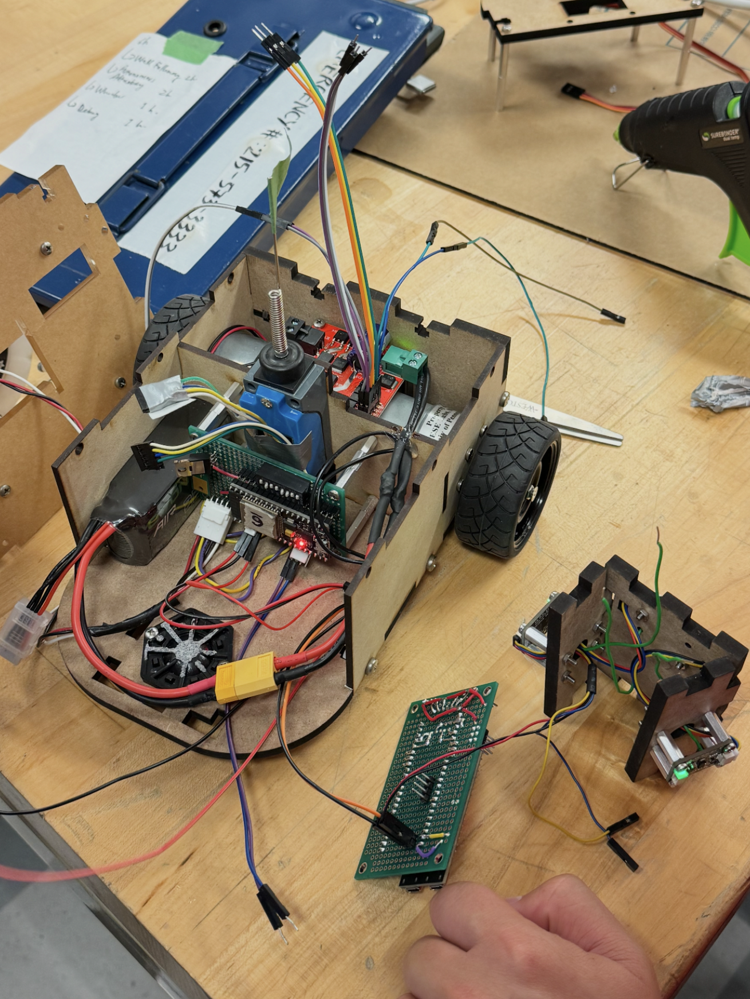

# Semi-Autonomous Arena PvP Battlebot

An autonomous and remote-controlled combat robot engineered for a 2v2 arena PvP battle game. Built on an ESP32-S3 microcontroller, the platform combines closed-loop RPM feedback, low-overhead Wi-Fi teleoperation, time-of-flight obstacle sensing, and a high-torque differential drive chassis designed to dominate physical engagements.

---

## Demo

Finale of the battle where our team("Fish tank") won in dominant fashion, taking overall first place. [View Competition](https://youtu.be/5AlRQYtUSHg)

Specific rulesets and strategic highlights described in sections below

  <strong>Robot Showcase</strong>  
  
  
  

Additional videos demos:

[Manual Drive Demo](https://youtube.com/shorts/q36u4zVWaII?feature=share)

[Wall Following Demo](https://youtube.com/shorts/mlVexiKmVw4)

---

## Game Concept & Arena Rules

The competition takes place in a MOBA-style arena game (similar to *League of Legends*):
* **Base Towers (Objective):** Each team's base is surrounded by physical buttons. Depressing an opponent's base button deducts base HP.
* **Tower Hazards:** Base buttons are guarded by a long slowly spinning, high-damage physical arm.
* **Center Capture Zones:** 2 center zones could be captured by teams, once captured, it deal automatic chip damage to opponent base.
* **Team Compositions:** 2 robots per team (built by 2 separate student groups) operating under autonomous, remote control (RC), or hybrid modes.
* **Hit Detection & Respawns:** Each robot carries an exposed whisker switch as its target zone. Strikes to this switch deduct HP; reaching 0 HP forces a timed respawn penalty.
* **Offensive Weapons:** Active mechanisms (e.g., servo-driven sweeping arms) are permitted within strict length constraints.
* **Communication Penalty:** RC mode is intended for emergency adjustments. To discourage continuous manual driving, every transmitted RC packet deducts **-1 HP** from the bot's health pool.

---

## Core Winning Strategy: Rulebook Exploits

> *"It’s not what the rule book says, it is what the rule book doesn't say that's important."*  
> — **Gordon Murray**

Our strategy focused on identifying rule loopholes and specifically engineering around them legally: the **RC health penalty** and the **tower hazard radius**.

### 1. Interrupt-Driven Teleoperation (Bypassing the Health Drain)
* **The Constraint:** Standard RC controllers continuously stream motion packets at high frequencies (e.g., 30 packets/sec), draining a bot's HP in ~3 seconds. Conversely, fully autonomous navigation suffered from unreliable localization due to ruleset limits and arena design flaws.
* **The Solution:** We replaced polling-based streaming with an **interrupt-based input**. Packets were transmitted *only* on keyboard event triggers (`key_press` / `key_release`). Using WASD controls for general piloting, along with pre-programmed complex subroutines (such as wall-following or dead-reckoning straight to the opponent tower).
* **The Impact:** A complete directional maneuver required only 2 packets (start/stop), giving us a budget of over 50 discrete maneuvers per respawn. Combining preset commands with manual piloting, we consistently reached the opponent base tower using <10 packets (5 discrete commands). While this sacrificed continuous analog speed control, it gave us much longer piloting stamina.

### 2. The Deployable "Brick" Concept
* **The Constraint:** To avoid the tower defense, a robot must either continuously dodge or tank heavy damage and respawn. Both of which cause attack downtime.
* **The Solution:** Deploying a literal "Brick" to hold down the button, allowing the robot to exit the hazard zone immediately while risking at most a single hit from the tower arm.
* **The Impact:** With the brick deployed, our robot faced zero risk from base defenses and zero attack downtime, achieving the theoretical fastest time-to-kill (TTK). Beyond optimal TTK, watching a robot cleanly "poop out" a dead-weight block onto a base button and casually drive away was easily the most demoralizing offensive play.

#### 2.1 High-Torque Closed-Loop Drive (Engineered for Payload & Ramp Climbing)
* **The Constraint:** To climb the arena ramps and overpower opponents in collisions while carrying additional payload weight, standard brushed DC motors would stall.
* **The Solution:** We selected high-gear-ratio motors and implemented a custom **encoder-based closed-loop PID speed controller**.
* **The Impact:** Maintained maximum available torque at low rotational speeds, preventing tire slippage and enabling high-traction control. When colliding with an opponent, our closed-loop controller automatically adjusted PWM to maintain target wheel RPM, completely overpowering open-loop, high-speed drives that stalled on contact.

---

## Strategic Evolution: "Brick 2.0" (Outsourcing Payload to the Enemy)

### The Unexpected Hardware Failure
A few days before the final matches, a power surge released the magic smoke from our voltage regulators, requiring an emergency system rebuild. To avoid risking the replacement hardware under the added electrical load of a mechanical deployment mechanism, we had to bench the brick right before match day.

### Competition Adaptation: The "Human Shield" Tactic
Without the physical payload, we adapted our high-torque drive and low-packet teleoperation into an aggressive grappling strategy. If we couldn't deploy a brick, we would turn enemy bots into interactive, non-consensual bricks. (Pro-tip: Stuffing a bag of nuts and bolts inside the chassis dramatically increased this effectiveness):

1. **Grapple & Overpower:** Using our closed-loop torque advantage, we physically rammed into opposing bots, and pushed them wherever we wanted.
2. **Pinned Traps:** We held enemy bots directly against their own base buttons, forcing them to trigger button damage on their own tower.
3. **Friendly Fire Exploitation:** By holding the enemy bot in place on the button, the spinning tower arm struck the opponent repeatedly instead of us; forcing our opponents into the unique humiliation of being beaten to death by their own tower.

---

## Design

### System Block Diagram

### Electrical Wiring

  <strong>Electrical circuit diagram and physical wiring</strong>  
  
  

### CAD Drawings

  <strong>CAD drawings for laser-cutting</strong>  
  
  

CAD files are included in the [`CAD`](CAD/) folder.

View On: [Onshape](https://cad.onshape.com/documents/e0dc42579e68e93aef5d59ea/w/8c1eb1d30bdd08e229fc6ead/e/ef994ec9ed3aac58ad461918?renderMode=0&uiState=6a8344eba45963f6586a078f) (right click and open as new tab to avoid 403 error)

### Software

Code used for the competition included in the [`Code`](Code/) folder.

